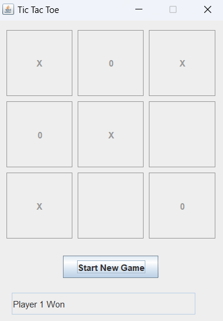
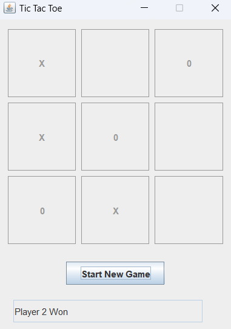
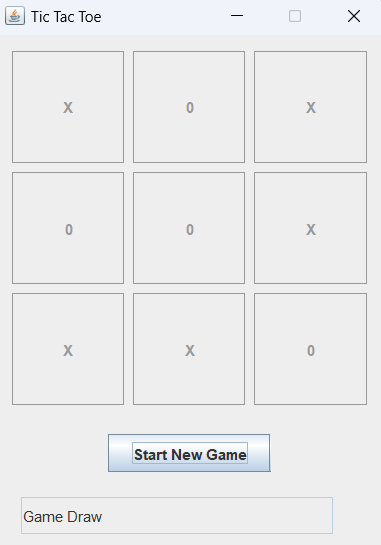

# Tic Tac Toe Game
This is a simple Tic Tac Toe game implemented in Java using Swing and AWT.

# Installation
* Download or clone the repository to your local machine.
* Ensure you have Java Development Kit (JDK) installed on your machine.
* Open a terminal or command prompt and navigate to the project directory.
* Compile the program by running the command "javac TicTacToe.java".
* Run the program by executing the command "java TicTacToe".
# How to Play
* The game can be played by two players.
* Player 1 uses the "X" mark, while Player 2 uses the "0" mark.
* The game starts when Player 1 clicks the "Start New Game" button.
* Players take turns to place their mark on the 3x3 grid by clicking on an empty cell.
* The first player to get three marks in a row, column or diagonal wins the game.
* If all cells are filled and no player has won, the game is a draw.
# ScreenShots

  
  
  

